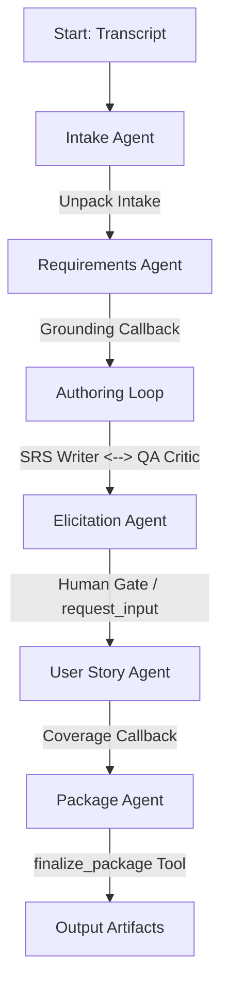

# 🏛️ Plinth — Requirements Discovery Agent (Google ADK Port)

**Turns discovery into a foundation downstream agents can build on.**


## The D differentiator: Anti-Hallucination & Provenance Integrity
Plinth's core guarantee is its strict **anti-hallucination and provenance-integrity control**:
* A requirement can only be promoted to `confirmed` status if its cited stakeholder quote matches a **verbatim substring** in the raw stakeholder transcript.
* Synthetic or inferred requirements are demoted to `assumed` or `open` status and can never be promoted without human/verbatim grounding.
* The final requirements package is blocked from downstream execution (`ready_for` is left empty `[]`) until all definition of ready rules and grounding constraints are satisfied.

*LLMs reason, but deterministic Python code enforces.*

---

## 1. Multi-Agent Architecture
Plinth runs on the Google Agent Development Kit (ADK) framework using a `SequentialAgent` spine:



* **Intake Agent (`gemini-2.5-flash`)**: Extracts high-level project metadata, verbatim stakeholder statements, and user personas.
* **Requirements Agent (`gemini-2.5-pro`)**: Compiles stakeholder statements into traceable requirements (`REQ-xxx`).
* **Authoring Loop (`LoopAgent`)**:
  * **SRS Writer (`gemini-2.5-flash`)**: Refines requirements based on review feedback.
  * **QA Critic (`gemini-2.5-pro`)**: Audits specifications for ambiguity and contradiction, appending findings as open questions.
* **Elicitation Agent (`gemini-2.5-pro`)**: Acts as the human gate, pausing execution via `request_input` if blocking open questions remain and resolving them with user answers.
* **User Story Agent (`gemini-2.5-flash`)**: Formats requirements into functional user stories (`US-xxx`).
* **Package Agent (`gemini-2.5-flash`)**: Deterministically compiles and writes the package deliverables.

All agents share a common `session.state` scratchpad and use `after_agent_callback` handlers to enforce data integrity.

---

## 2. Setup
1. **Python Version**: Python `>=3.11` and `<3.14`.
2. **Install dependencies**:
   ```bash
   pip install -e .
   ```
3. **Configure Environment**:
   Copy `.env.example` to `.env` and fill in your keys:
   ```bash
   GEMINI_API_KEY=your_gemini_api_key
   # Set to FALSE to bypass Vertex AI cloud routing and use the direct Gemini API Key
   GOOGLE_GENAI_USE_VERTEXAI=FALSE
   ```

---

## 3. Run and Debug
- **Run local server & CLI playground**:
  Launch the local interactive UI (web UI, event graphs, and artifact inspector):
  ```bash
  agents-cli playground
  # Or: adk web
  ```
- **CLI Run**:
  Run a one-shot execution from the command line:
  ```bash
  agents-cli run "Generate requirements for SpinCycle"
  # Or: adk run plinth_agent
  ```
- **Handoff Package Landing**:
  All generated outputs are written to the `./output/` directory and registered as ADK artifacts.

---

## 4. SpinCycle Run Snapshot
A typical run against the `sample_transcript.txt` stakeholder interview produces the following results:
* **Requirements**: 67 discovered, with **65 confirmed and 100% verbatim-grounded** in the transcript text.
* **User Stories**: 53 functional stories covering all `must` and `should` requirements.
* **Coverage Ratio**: `0.90` (90% transcript coverage with honest `uncovered_topics`).
* **Downstream Readiness**: Once all blocking open questions are cleared by the human gate, the manifest's `ready_for` capability lists `architecture_agent`, `backend_agent`, and other downstream builders.


